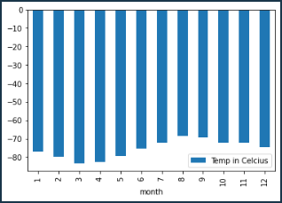

# Mars Data Web Scraping

This project demonstrates web scraping techniques to gather Mars data, such as news, weather, and temperatures. The data is then processed and analyzed using Python, Pandas, and Matplotlib.

## Requirements

* Splinter.
* BeautifulSoup
* Requests
* Pandas
* Matplotlib
* ChromeDriverManager
* Pymongo

## Part 1 - Web-Scraping Mars News

Part 1 scrapes news articles about Mars from the '[https://redplanetscience.com](https://redplanetscience.com/)' website using the Splinter package. The article titles, preview texts, and dates are extracted and stored in a list of dictionaries. The data is then converted into a Pandas DataFrame for easier viewing and manipulation. Finally, the data is saved to a JSON file and inserted into a MongoDB collection.

## Part 2 - Web-Scraping Mars Weather Data

Part 2 scrapes Mars weather data from the '[https://data-class-mars-challenge.s3.amazonaws.com/Mars/index.html](https://data-class-mars-challenge.s3.amazonaws.com/Mars/index.html)' website using the Requests package. The data is processed and converted into a Pandas DataFrame. The code then performs some basic analysis on the data, such as calculating the number of Martian months, the average low temperature by month, and average pressure by month. The results are visualized using bar plots. Finally, the data is saved to a CSV file.

### Mars Weather Analysis Notes

The following analysis is performed on the Mars weather data:

1. **Number of Martian months** : The code calculates the number of Martian months present in the dataset by grouping the data by the 'month' column and counting the unique months.

   
2. **Martian days' worth of data** : The code finds the maximum value of the 'sol' column, which represents the number of Martian days (sols) since the Curiosity rover's landing.

   
3. **Average low temperature by month** : The code calculates the average low temperature for each Martian month by grouping the data by the 'month' column and taking the mean of the 'min_temp' column.

   
4. **Coldest and hottest months** : The code identifies the coldest and hottest months in Curiosity's location by finding the months with the lowest minimum temperature and highest minimum temperature, respectively.

   
5. **Coldest and hottest days** : The code identifies the coldest and hottest days in Curiosity's location by finding the days with the lowest and highest 'min_temp' values, respectively.

   
6. **Average pressure by Martian month** : The code calculates the average pressure for each Martian month by grouping the data by the 'month' column and taking the mean of the 'pressure' column.

   

# Conclusion

This repository demonstrates a variety of web scraping and data analysis techniques. The final output is a collection of Mars news stories, weather data, and an analysis of the data collected.
